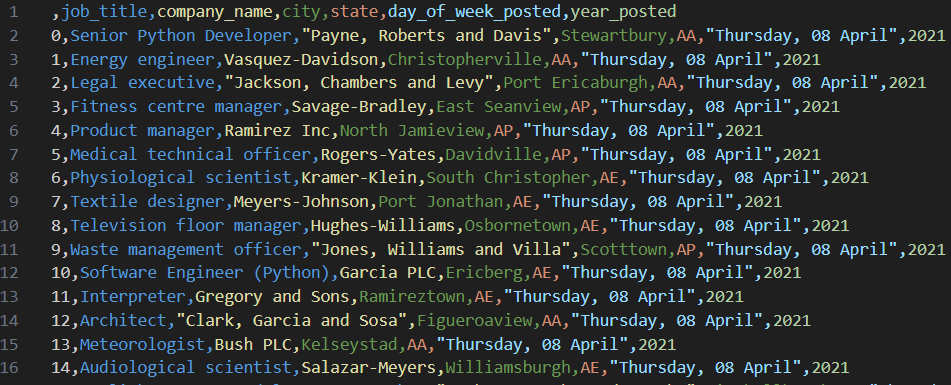

# Job Listings Web Scraper

### 📌 Project Overview

This project is a simple web scraper that extracts job listings from a website, processes the data, and saves it as a CSV file. The script uses BeautifulSoup for HTML parsing, requests for making HTTP requests, and pandas for data processing.

### 🛠 Technologies Used

- Python

- BeautifulSoup (for web scraping)

- Requests (for making HTTP requests)

- Pandas (for data processing and exporting CSV files)

- Datetime (for handling date formatting)

### 📂 Project Structure

### ⚡ How It Works

1. The script makes an HTTP request to the given URL.

2. Extracts job titles, company names, locations, and posted dates.

3. Transforms the data into a structured dictionary.

4. Converts the extracted data into a Pandas DataFrame.

5. Saves the data to a CSV file.

### 🚀 Setup and Installation

#### Prerequisites

Ensure you have Python 3.* installed.

1️⃣ Clone the Repository

2️⃣ Install Dependencies (pandas, requests, beautifulsoup). 

3️⃣ Run the Script

📊 Output Example

After running the script, a job_posted_data.csv file will be generated with the following columns:

### 🛠 Functions Explained

#### get_data(url) → soup

Fetches the HTML content from the given URL and returns a BeautifulSoup object.

#### transform_data(soup) → dict

Extracts job details such as title, company name, location, and date posted, then structures them into a dictionary.

#### load_to_csv(transformed_data, file_name='job_posted_data')

Converts the extracted data into a CSV file for easy access.

### 📝 Notes

The script currently scrapes data from https://realpython.github.io/fake-jobs/.

You can modify the URL in web_scraper.py to scrape job listings from other sources.

Ensure compliance with legal policies before scraping any website.

### 🎯 Future Enhancements

✅ Add a database storage option (SQLite, PostgreSQL, etc.)
✅ Implement pagination handling for larger datasets
✅ Schedule automated scraping using cron jobs or Celery

### 🤝 Contributing

Feel free to fork this repository and submit pull requests with improvements!

### 📜 License

This project is open-source and available under the MIT License.